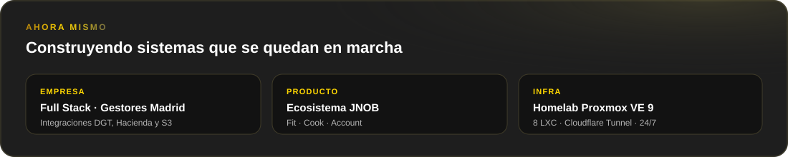
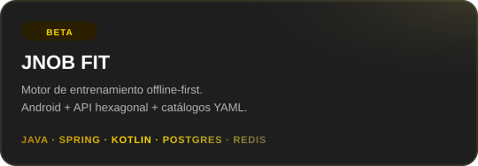
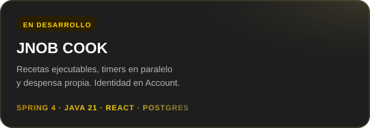
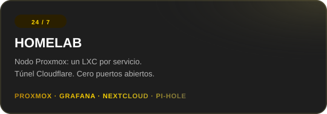
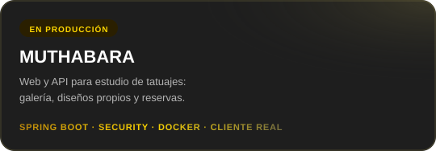
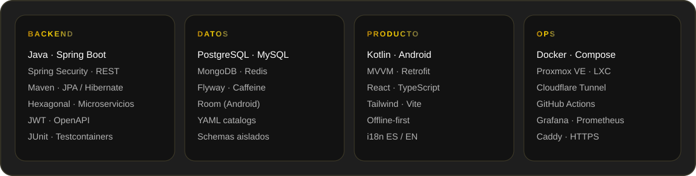

<!--
  Perfil GitHub de Jordy Camacho.
  Paleta alineada con jordycamacho.dev y JNOB FIT:
  #121212 · #1E1E1E · #78703F · #B8860B · #FFD700
-->

  

  

  
  
  
  

  

  

### Sobre mí

Soy **Jordi Camacho Castillo**, desarrollador backend en Madrid. Trabajo con **Java y Spring Boot**: APIs REST, seguridad, PostgreSQL y despliegue con Docker.

Combino el trabajo en empresa y freelance con un ecosistema propio — **JNOB FIT**, **JNOB Cook** y el microservicio **JnobAccount** que los comunica — y un **homelab Proxmox** que opero 24/7.

Me importa la ingeniería bien hecha: arquitectura clara, fronteras de dominio, seguridad real y sistemas que siguen en marcha.

- Madrid, España · Español nativo · Inglés B1
- Full Stack en el Ilustre Colegio Oficial de Gestores Administrativos de Madrid
- Certificación Java OCP (en curso)
- Casos de estudio en [jordycamacho.dev](https://jordycamacho.dev)

  

  

### Trabajo seleccionado

  
  

  
  

  

  

### Stack

  

  
  
  
  
  
  
  
  
  
  
  
  

  

### Actividad

  
  

  

  

  

  

### Hablemos

Si necesitas un backend desde cero, una API o un producto full-stack — **escríbeme**.

  
  

  

