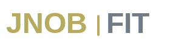

# JNOB FIT - Sistema de Logos

## 🎨 Colores de Marca

### Colores Principales
- **JNOB Gold**: `rgb(188, 169, 91)` / `#BCA95B`
- **Product Gray**: `rgb(115, 123, 134)` / `#737B86`
- **Background Dark**: `#0A0A0A`
- **Background Light**: `#FFFFFF`

## 📦 Archivos Incluidos

### Logos SVG (Vectoriales - Escalables)
1. **logo.svg** - Logo horizontal principal (280x80px)
   - Uso: Navbar, headers, emails
   
2. **logo-with-icon.svg** - Logo con ícono fitness (300x100px)
   - Uso: Landing pages, presentaciones, marketing
   
3. **logo-app-icon.svg** - Ícono de aplicación (512x512px)
   - Uso: App icon, avatar de redes sociales
   
4. **favicon.svg** - Favicon minimalista (64x64px)
   - Uso: Favicon del sitio web

5. **logo-system.html** - Página interactiva con TODAS las variaciones
   - Incluye 6+ versiones diferentes
   - Descarga individual de cada variante
   - Versiones en fondo claro y oscuro

## 🎯 Guía de Uso

### Para Navbar (Website)
```html

```

### Para App Icon
Use `logo-app-icon.svg` y convierta a PNG en las siguientes resoluciones:
- 512x512px (Android xxxhdpi)
- 192x192px (Android xxhdpi)
- 128x128px (Android xhdpi)
- 96x96px (Android hdpi)

### Para Favicon
```html
<link rel="icon" type="image/svg+xml" href="favicon.svg">
```

## 🔮 Futuros Productos

Para productos futuros de JNOB (Cook, Studie, etc.):
1. Mantén **JNOB** siempre en `rgb(188, 169, 91)`
2. Cambia solo el nombre del producto y su color
3. Usa colores distintivos para cada producto
4. Mantén la misma estructura visual

Ejemplo:
- JNOB (dorado) + COOK (naranja/rojo)
- JNOB (dorado) + STUDIE (azul)

## 💡 Reglas de Marca

✅ **SÍ HACER:**
- Usar los colores exactos especificados
- Mantener proporciones del logo
- Usar fondo contrastante (oscuro o claro)
- Dar espacio de respiro alrededor del logo

❌ **NO HACER:**
- Cambiar los colores de JNOB
- Rotar o distorsionar el logo
- Agregar efectos o sombras no autorizados
- Usar sobre fondos que no contrastan

## 🛠️ Conversión a PNG

Si necesitas PNG en vez de SVG:

```bash
# Con Inkscape
inkscape logo.svg --export-png=logo.png --export-width=1000

# Con ImageMagick
convert -background none logo.svg -resize 1000x logo.png

# Con rsvg-convert
rsvg-convert -w 1000 logo.svg > logo.png
```

## 📱 Tamaños Recomendados

### Web
- Navbar: 150-200px de ancho
- Footer: 120-150px de ancho
- Favicon: 32x32px, 64x64px

### Redes Sociales
- Facebook: 820x462px
- Instagram: 1080x1080px
- Twitter: 400x400px

### App Stores
- Google Play: 512x512px
- App Store (iOS): 1024x1024px

---

**Versión del Sistema:** 1.0  
**Fecha:** 2024  
**Marca:** JNOB  
**Producto:** FIT
